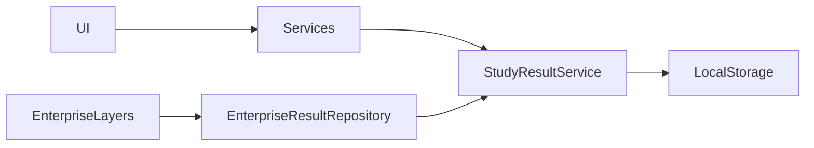

# StudyBook AI Architecture Overview

## Modulos Principales

- Teacher Studio.
- Academic Engine.
- Unit Workspace.
- Student Studio.
- Learning Engine.
- AudioBook Studio.
- Voice Intelligence.
- CampusAI Intelligence.
- Marketplace Foundation.
- Institution Platform.
- Gamification.
- Enterprise Notifications.
- AI Agents.
- Workflow Engine.
- Decision Engine.
- Security Foundation.
- Observability Foundation.
- Production Cache.
- Background Tasks.

## Servicios

- `StudyResultService`: persistencia local principal.
- `EnterpriseResultRepository`: persistencia local-first para capas enterprise.
- `AcademicResourceRepository`: persistencia de recursos academicos.
- `LearningAnalyticsService`: analitica de aprendizaje.
- `VoiceSessionService`: sesiones de voz.
- `MarketplaceService`: catalogo local.
- `InstitutionService`: dashboard institucional local.
- `SecurityScanService`: revision local de patrones sensibles.

## Flujo De Datos

## StudyResult Types

- `teaching_plan`
- `question_bank`
- `exam`
- `rubric`
- `study_guide`
- `assessment_report`
- `workflow_execution`
- `agent_execution`
- `decision_history`
- `workflow_history`
- `creator_dashboard`
- `marketplace_history`
- `institution_workspace`
- `voice_pipeline`
- `prediction_cache`
- `dashboard_cache`
- `release_candidate_report`
- `rc_quality_gate`
- `qa_scenario`
- `qa_report`
- `technical_documentation`
- `release_notes`
- `service_inventory`

## Enterprise Layers

- AI orchestration coordina agentes locales y capacidades.
- Workflow Engine define pipelines configurables.
- Decision Engine prioriza acciones deterministicas.
- Marketplace e Institution son foundation/local-first.
- Observability y Security no envian datos externos.
- Production Cache usa TTL local.

## Riesgos Conocidos

- Marketplace no tiene pagos reales.
- Institution no tiene cloud multi tenant real.
- Voice V5 no implementa streaming real.
- Algunos dashboards consumen servicios pesados y deben mantener cache.
- Los 25 infos historicos de Flutter analyze siguen pendientes.

## Proximos Pasos

- Ejecutar QA manual RC1.
- Medir carga real de Dashboard en navegador.
- Revisar security scan antes de build final.
- Preparar release notes funcionales para usuarios piloto.
