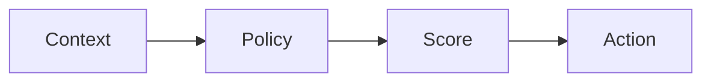

# Decision Engine

## Dependencias

- `DecisionContext`
- `DecisionPolicy`
- `EnterpriseResultRepository`

## Flujo

1. Evaluar riesgo, engagement, objetivos, fatiga y contexto institucional.
2. Calcular puntuación determinística.
3. Guardar decisión en `decision_history`.

## TODO

- Ajustar pesos por tenant.
- Conectar señales reales de mercado e institución.
