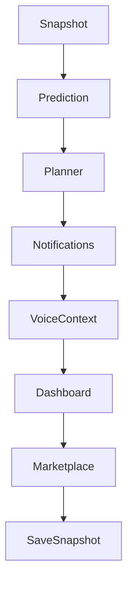

# Workflow Engine

## Dependencias

- `EnterpriseResultRepository`
- `StudyResult` type `workflow_execution`

## Flujo

1. Definir pasos configurables.
2. Ordenar por dependencias.
3. Ejecutar handlers registrados.
4. Guardar ejecución e historial.

## TODO

- Registrar handlers reales por módulo.
- Agregar scheduler persistente cuando exista backend.
