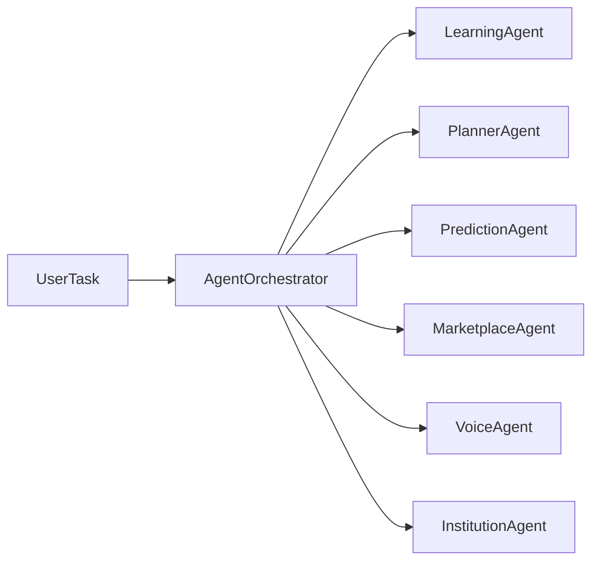

# AI Agents Enterprise

## Dependencias

- `BaseAgent`
- `AgentTask`
- `AgentResponse`

## Flujo

1. Recibir tarea.
2. Enrutar por agente o capacidad.
3. Ejecutar colaboración entre agentes ordenada por prioridad.

## TODO

- Conectar métricas reales por agente.
- Persistir historiales completos de colaboración.
