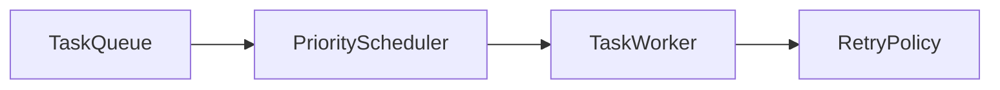

# Background Tasks 2.0

## Dependencias

- `BackgroundTask`
- `RetryPolicy`
- `CancellationToken`

## Flujo

1. Encolar tareas.
2. Priorizar por prioridad y fecha.
3. Cancelar o reintentar según política.

## TODO

- Worker persistente.
- Recurrencia con reloj real.
