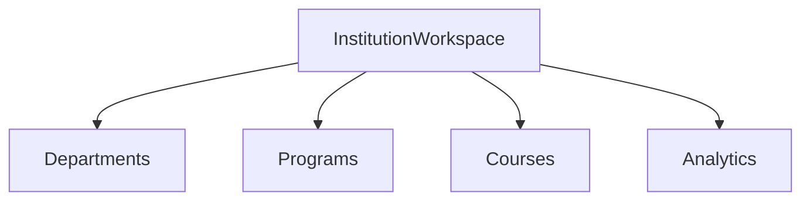

# Institution Cloud Ready

## Dependencias

- `InstitutionWorkspace`
- `InstitutionService`

## Flujo

1. Construir workspace local-first.
2. Persistir contratos en `institution_workspace`.
3. Preparar campos cloud-ready sin backend nuevo.

## TODO

- Sincronización multi tenant real.
- Permisos institucionales por rol.
