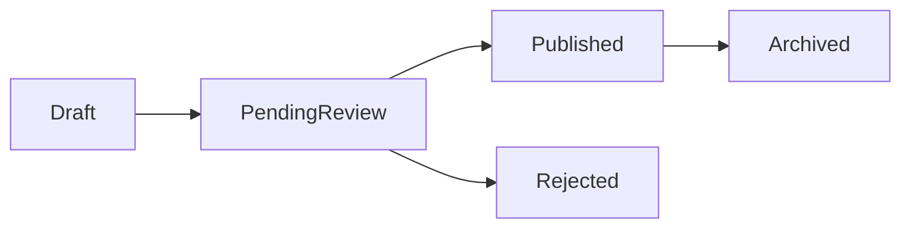

# Marketplace Production Foundation

## Dependencias

- `MarketplaceItem`
- `EnterpriseResultRepository`

## Flujo

1. Preparar contrato de publicación.
2. Mantener estado y versiones.
3. Guardar dashboard de publisher y creator.

## TODO

- Revisiones reales.
- Pagos reales quedan fuera de este sprint.
