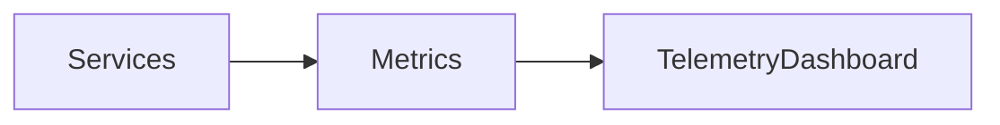

# Observability Enterprise

## Dependencias

- `TelemetryDashboard`
- `EnterpriseObservabilityService`

## Flujo

1. Recibir métricas por dominio.
2. Consolidar dashboard local.
3. Preparar salida para UI o exportación.

## TODO

- Persistencia histórica.
- Visualización en panel enterprise.
