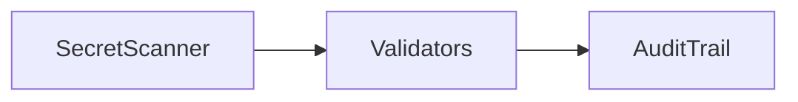

# Security Enterprise

## Dependencias

- `SecurityScanService`
- `RoleValidator`
- `InstitutionValidator`

## Flujo

1. Escanear secretos.
2. Validar permisos, roles, capacidades, premium e institución.
3. Registrar auditoría local.

## TODO

- Firma de auditoría.
- Integración multi tenant completa.
