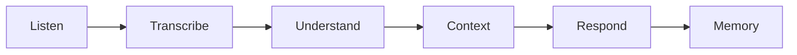

# Voice V5 Foundation

## Dependencias

- `ConversationPipeline`
- `SpeechPipeline`

## Flujo

1. Definir pipeline conversacional.
2. Manejar interrupciones, cola, memoria y wake word.
3. Dejar streaming como stub.

## TODO

- Streaming real.
- Integración con micrófono conversacional.
