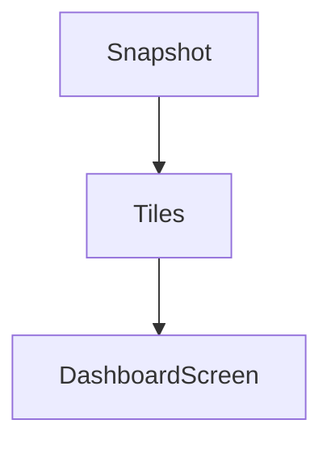

# Enterprise Dashboard Widgets

## Dependencias

- `EnterpriseDashboardTile`
- `EnterpriseDashboardSnapshot`

## Flujo

1. Consumir snapshot enterprise.
2. Pintar tiles reutilizables.
3. Integrar en pantallas existentes sin tocar navegación.

## TODO

- Conectar tiles a dashboard real en sprint separado.
